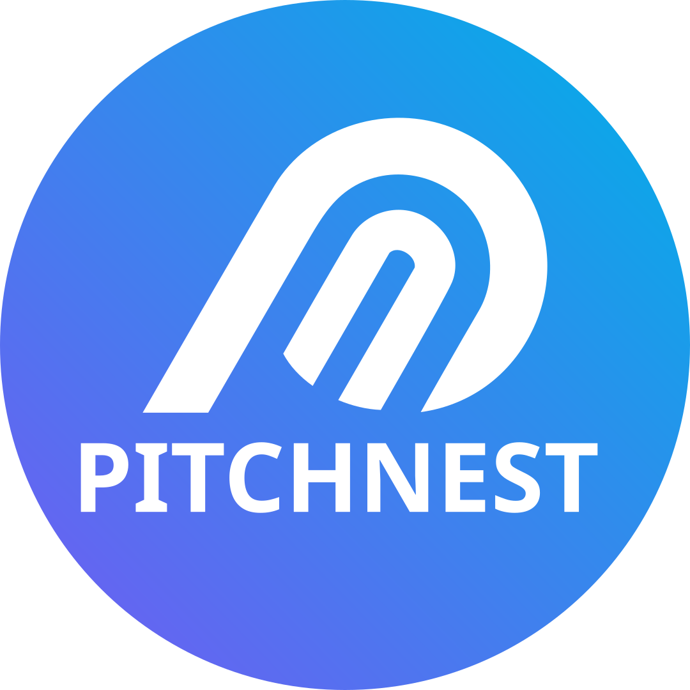

<p align="center">
  
</p>

<h1 align="center">PitchNest Mobile</h1>

<p align="center">
  <strong>Native iOS & Android Pitch Simulation App for Startup Founders</strong>
</p>

<p align="center">
  <a href="https://reactnative.dev"></a>
  <a href="https://expo.dev"></a>
  <a href="https://www.typescriptlang.org"></a>
  <a href="https://apple.com/app-store"></a>
  <a href="https://expo.dev/eas"></a>
  <a href="LICENSE"></a>
</p>

---

## 📱 Overview

**PitchNest Mobile** brings the full AI investor boardroom experience directly onto your smartphone. Built with **React Native** and **Expo**, it allows startup founders to practice pitching, handle live investor cross-examination, and review readiness reports wherever they are:

* **Native Audio & Mic Capture**: High-quality 16 kHz PCM voice streaming (`expo-audio`) to the cloud AI panel over WebSockets.
* **Deck Slide Viewer**: Founders can view and swipe through their uploaded pitch deck slides during live pitch practice.
* **Hardware-Encrypted Auth**: Secure JWT storage using native platform keystore (`expo-secure-store`).
* **App Store & Google Play Ready**: Complete with in-app account deletion, privacy policies, terms, and store submission checklists.

---

## ✨ Features

- **🎙️ Real-Time Voice Pitching**: Real-time voice interaction with AI personas (Marcus, Sarah, Chen, Riley) powered by Azure Speech & OpenAI.
- **📑 Mobile Deck Viewer**: Native slide viewer allowing founders to navigate slides in sync with the live conversation.
- **📊 Post-Pitch Reports & History**: Instant access to pitch readiness scores, investor reaction metrics, and session summaries.
- **📱 Native Controls & Performance**: Fluid navigation with React Navigation, bottom tabs (Home, Pitch, Decks, History, Profile), and haptic transitions.
- **🛡️ Store Compliance Built-In**:
  - In-app Account Deletion (Apple App Store Guideline 5.1.1(v) & Google Play compliance).
  - Explicit AI generation disclosures.
  - In-app Privacy Policy, Terms of Service, and support links.

---

## 🛠️ Project Structure

```text
PitchNest-Mobile/
├── assets/                # App icons, splash screens, adaptive icons
├── docs/                  # App Store compliance, legal audits, build guides
│   ├── APP_STORE_COMPLIANCE.md
│   ├── LEGAL_AUDIT.md
│   ├── MOBILE_BUILD_GUIDE.md
│   └── STORE_LISTING.md
├── scripts/
│   └── smoke-test-api.mjs # Production API connectivity smoke test
├── src/
│   ├── components/        # UI components (DeckSlideViewer, Button, ScoreBars, etc.)
│   ├── config/            # Environment & backend endpoints (env.ts)
│   ├── constants/         # Theme, recording parameters, legal text
│   ├── contexts/          # AuthContext, PitchContext
│   ├── hooks/             # Custom React Native hooks
│   ├── lib/               # API clients, encrypted storage wrapper
│   ├── navigation/        # Root, Auth, and MainTab navigators
│   ├── screens/           # LiveRoomScreen, SetupScreen, ReportScreen, Profile, etc.
│   └── types/             # TypeScript interfaces and navigation types
├── app.json               # Expo application configuration (bundle ID: com.pitchnest.app)
├── eas.json               # Expo Application Services build profiles
├── package.json           # Mobile dependencies and scripts
└── tsconfig.json          # TypeScript configuration
```

---

## 🏁 Getting Started

### Prerequisites
* **Node.js**: v18.0.0 or later (v20+ recommended)
* **Expo Go** app installed on your physical iPhone or Android device (available on App Store / Google Play).

### Installation

```bash
# Clone the repository
git clone https://github.com/PitchNest-Lab/PitchNest-Mobile.git
cd PitchNest-Mobile

# Install dependencies
npm install
```

### Running Locally

```bash
npx expo start
```

* **Physical Device:** Scan the displayed QR code using the **Expo Go** app.
* **iOS Simulator (macOS):** Press `i` in the terminal.
* **Android Emulator:** Press `a` in the terminal.

### Production API Smoke Test

Verify that the mobile app can reach the live backend endpoints:

```bash
node scripts/smoke-test-api.mjs
```

---

## 🚀 Building for TestFlight & Google Play (EAS)

This project is configured with [eas.json](eas.json) under the bundle identifier `com.pitchnest.app`.

### 1. Install EAS CLI
```bash
npm install -g eas-cli
eas login
```

### 2. Build for iOS (TestFlight)
```bash
# Build preview IPA
eas build --profile preview --platform ios

# Submit to App Store Connect
eas submit --platform ios
```

### 3. Build for Android (Google Play)
```bash
# Build Android App Bundle (AAB)
eas build --profile production --platform android

# Submit to Google Play Console
eas submit --platform android
```

> [!TIP]
> For step-by-step submission instructions, review [docs/MOBILE_BUILD_GUIDE.md](docs/MOBILE_BUILD_GUIDE.md).

---

## 🔗 Related Repositories

| Repository | Description |
| :--- | :--- |
| **[PitchNest-Frontend](https://github.com/PitchNest-Lab/PitchNest-Frontend)** | React 19 + Vite 6 web single-page application |
| **[PitchNest-Backend](https://github.com/PitchNest-Lab/PitchNest-Backend)** | Express & WebSocket API server, Azure AI/Speech engine, Supabase integration |

---

## 📄 License

This project is licensed under the MIT License.
